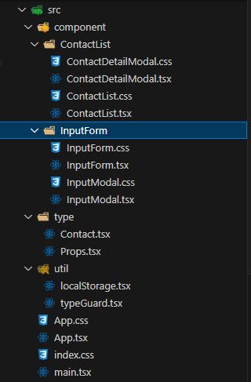
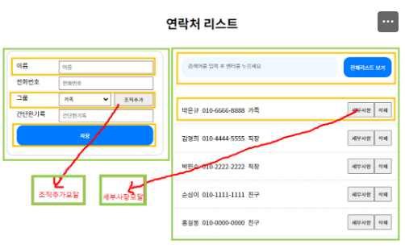
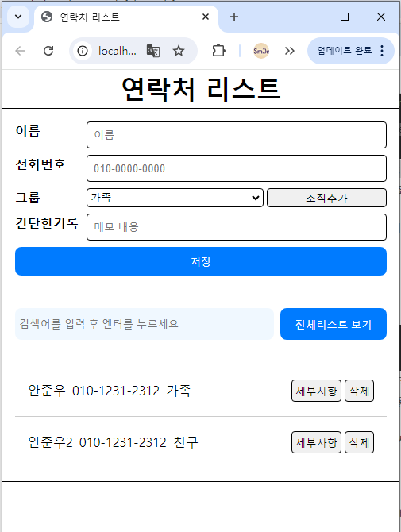

**1차 목표** - 설계 및 레이아웃

폴더 구조 설계 (Folder Structure Design),

컴포넌트 설계(Component Design)

반응형 레이아웃 적용할 수 있다.

**2차 목표** - 데이터 바인딩

더미 데이터를 활용

데이터 바인딩

**3차 목표** - 기본 기능

리스트 추가 기능

input 요소 유효성 검사 - 한글만 입력, 핸드폰 형식에 맞춰서 입력, 빈 내용 체크

모달 열기 / 닫기 기능

리스트 검색 기능

삭제 기능

localStorage로 데이터 저장 (연락처 리스트(contactList) 와 그룹리스트 (groups) )

**4차 목표** - 엣지케이스

입력 완료 후 input 요소 초기화 및 focus

동일한 이름을 등록할 때 메시지 출력 (동일한 이름으로 등록 된 리스트가 있어요.)

그룹 삭제 시 사용중인 그룹명이 있으면 그룹 삭제 버튼 비활성화

상세 페이지에서 수정 기능 추가

# 미완료된 기능

4차 목표 : 그룹 삭제 시 사용중인 그룹명이 있으면 그룹 삭제 버튼 비활성화
4차 목표 : 상세 페이지에서 수정 기능 추가

# 완료된 기능

# 1차 목표

## 폴더 구조 설계 (Folder Structure Design)

component : 컴포넌트 폴더
type : 공통으로 사용되는 타입과 Props로 된 인터페이스 정의
util : 해당 컴포넌트에만 속하는 함수는 아니지만 여러모로 사용되는 함수들 (타입가드함수, 로컬스토리 건드리는 함수)

index.css : 공통으로 적용되는 css

그 외 App.css나 컴포넌트별 css는 해당 컴포넌트에만 적용되는 css 입니다.

## 컴포넌트 설계(Component Design)

강사님이 제시했던 기준대로 4개로 나뉘어 개발하였습니다.

왼쪽 form 컴포넌트
그룹 추가 모달 컴포넌트
오른쪽 list 컴포넌트
상세보기 모달 컴포넌트

## 반응형 레이아웃 적용할 수 있다.

900px 기준으로 diplay 방향만 바꿔서 아래로 떨어지도록 하였습니다.

# 2차 목표

## 더미 데이터를 활용

크게 문제없었던 부분이라 생량하겠습니다.

## 데이터 바인딩

크게 문제없었던 부분이라 생량하겠습니다.

# 3차 목표

## 리스트 추가 기능

구현 완료

## input 요소 유효성 검사 - 한글만 입력, 핸드폰 형식에 맞춰서 입력, 빈 내용 체크

구현완료

한글의 경우 이름 중복이 있을 수 있으니 2자 이상 + 숫자도 허용하는 식으로 구현
ex) 안준우1, 안준우2 가능

핸드폰 형식의 경우 010-0000-0000 형식이어야 하며
하이푼(-) 의 경우 그냥 숫자를 입력하면 자동으로 달리도록 하였음.

빈 내용인 경우 '저장' 버튼 누를시에 alert 창 뜨도록 구현

## 모달 열기 / 닫기 기능

구현완료

## 리스트 검색 기능

구현완료

검색 값이 없거나 초기에는 '검색 결과가 존재하지 않습니다.' 라는 문구가 뜨도록 구현

## 삭제 기능

구현완료

# 4차 목표

# 입력 완료 후 input 요소 초기화 및 focus

'저장' 누를시 초기화 후 이름 폼에 focus 가도록 구현

검색어 입력하는 input의 경우 'Enter'를 눌러도 focus가 따로 변경되지 않기 때문에 별도 조치 X

# 동일한 이름을 등록할 때 메시지 출력 (동일한 이름으로 등록 된 리스트가 있어요.)

동일한 이름 등록시 '동일한 이름으로 등록 된 리스트가 있어요.' alert 출력
같은 이유로 그룹 추가시에도 동일한 그룹 존재하면 '중복 그룹이 존재합니다. 추가할 수 없습니다.' alert 출력
